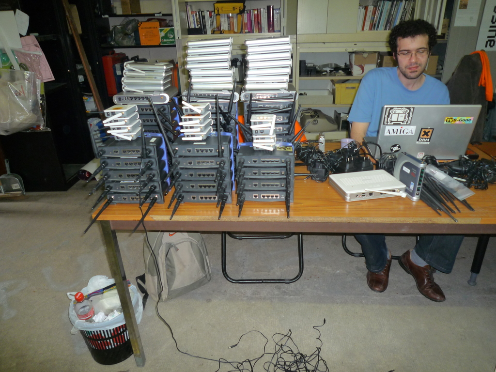

About
=====

Presentation "MultipathTCP with (un)meshed networks + running Babel/OLSR/BMX7 inside Kubernetes and containers" at Battlemesh v12, Paris, Fri 12 Jul 2019

Speaker(s): Benjamin Henrion (zoobab)
Date: 2019-07-12, 10:30-11:50
Location: 6b conference room
This talk will be split in 2 parts:
1. MultipathTCP with (un)meshed networks, which is the result of 2 years of GSOC on integrating MultipathTCP inside OpenWRT, and optimising a TCP SOCKS proxy to double the speed of your connexion. See the second part "GSoC 2018 - project presentations" https://www.youtube.com/watch?v=P0BWgeNpBOU&t=859
2. Running Babel/OLSR/BMX7 inside Kubernetes and containers, see https://github.com/zoobab/babeld-in-docker and https://github.com/zoobab/olsrd-in-docker

Slides
======

## Swpat yesterday

## Eiffel tower as an antenna

## WBM v1 at /tmp/lab in Paris, 10 years ago

## WBM v1: 3 routing protocols

## WBM v1: beer caps as power supply radiators 

## WBM v1: Asus WL-HDD and Lolo 

## Samsung Chord SDK and ZeroMQ

## ZeroMQ, the lightweight messaging library

## Zyre, an open-source framework for proximity-based peer-to-peer applications

## Glinet AR150, the router of choice

## Hardware vending machine at Revspace.nl

## Midicast at ZMQ hackaton

## Midicast at FOSDEM

Videos
======

Links
=====

* https://www.battlemesh.org/BattleMeshV12/Events#MPTCP-virtualtested
* 
