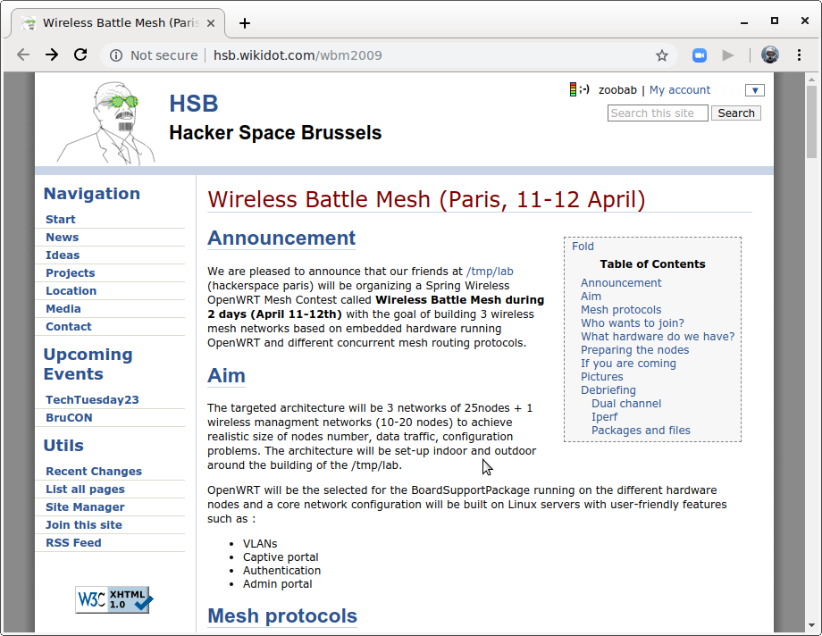

About
=====

Presentation "MultipathTCP with (un)meshed networks + running Babel/OLSR/BMX7 inside Kubernetes and containers" at Battlemesh v12, Paris, Fri 12 Jul 2019

Speaker(s): Benjamin Henrion (zoobab)
Date: 2019-07-12, 10:30-11:50
Location: 6b conference room
This talk will be split in 2 parts:
1. MultipathTCP with (un)meshed networks, which is the result of 2 years of GSOC on integrating MultipathTCP inside OpenWRT, and optimising a TCP SOCKS proxy to double the speed of your connexion. See the second part "GSoC 2018 - project presentations" https://www.youtube.com/watch?v=P0BWgeNpBOU&t=859
2. Running Babel/OLSR/BMX7 inside Kubernetes and containers, see https://github.com/zoobab/babeld-in-docker and https://github.com/zoobab/olsrd-in-docker

Slides
======

## Swpat yesterday

## Eiffel tower as an antenna

## WBM v1 at /tmp/lab in Paris, 10 years ago

## WBM v1: 3 routing protocols

## WBM v1: beer caps as power supply radiators 

## WBM v1: Asus WL-HDD and Lolo 

## Babel workshop in Paris

## WBM v1: HSBXL webpage as history

## WBM v1: dual radios patch to Babel

## MultipathTCP topology

## OLSRD in Kubernetes

Links
=====

* Eiffel tower as an antenna: https://fr.m.wikipedia.org/wiki/Fichier:Antenne_tour_Eiffel_1914.jpg
* WBMv12 schedule: https://www.battlemesh.org/BattleMeshV12/Events#MPTCP-virtualtested
* WBMv1: http://hsb.wikidot.com/wbm2009
* Babel in docker: https://github.com/zoobab/babeld-in-docker
* OLSR in docker: https://github.com/zoobab/olsrd-in-docker
* BMX7 in docker: https://github.com/zoobab/bmx7-in-docker
* GSoC 2018 - project presentations: https://www.youtube.com/watch?v=P0BWgeNpBOU&t=859
* Multipath Wi-Fi bridging with transparent MPTCP proxy: https://www.youtube.com/watch?v=1xQQuT9BGuI
